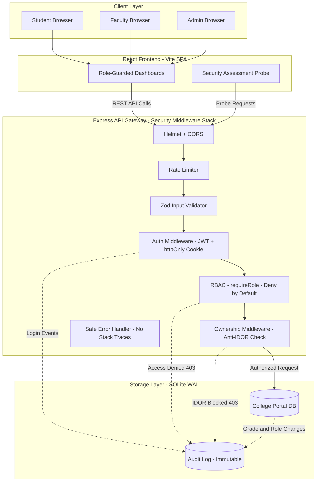

# College Portal with Role-Based Access Control (RBAC)

A secure, local-only web application developed for cybersecurity assessments. This portal demonstrates the implementation of **Role-Based Access Control (RBAC)**, **Insecure Direct Object Reference (IDOR) prevention**, **cryptographic session security**, **input validation**, and **immutable security audit logging** adhering to OWASP guidelines and the Principle of Least Privilege.

---

## 1. System Architecture Diagram



---

## 2. Role-Permission Matrix (Server-Side Enforced)

All routes follow a **Deny-by-Default** security posture. Any action or endpoint not explicitly permitted below yields a `403 Forbidden` response.

| Resource / Endpoint | Action | Student | Faculty | Admin | Server Enforcement Mechanism |
| :--- | :--- | :---: | :---: | :---: | :--- |
| `POST /api/auth/login` | Authenticate & establish session | ✅ | ✅ | ✅ | Rate limited + `bcrypt.compare` + `httpOnly` cookie |
| `POST /api/auth/logout` | Invalidate session | ✅ | ✅ | ✅ | Clears cookie + logs event |
| `GET /api/auth/session` | Get active session state | ✅ | ✅ | ✅ | Verified via server-side JWT signature |
| `GET /api/students/me` | View own student profile | ✅ | ❌ | ❌ | `requireRole('student')` + `req.user.id` |
| `GET /api/students/me/grades` | View own enrolled grades | ✅ | ❌ | ❌ | Queries DB strictly for `req.user.id` |
| `GET /api/students/:id/grades` | View specific student's grades | ❌ Own only | ❌ | ✅ | `requireStudentOwnership` Anti-IDOR |
| `GET /api/faculty/courses` | View assigned teaching courses | ❌ | ✅ | ❌ | `requireRole('faculty')` + faculty_id filter |
| `GET /api/faculty/courses/:id/students` | View students in assigned course | ❌ | ✅ Assigned | ✅ | `requireFacultyCourseAssignment` middleware |
| `POST /api/faculty/grades` | Update grade for course student | ❌ | ✅ Assigned | ✅ | Validates course assignment & enrollment |
| `GET /api/admin/users` | List all system accounts | ❌ | ❌ | ✅ | `requireRole('admin')` |
| `POST /api/admin/users` | Provision new user account | ❌ | ❌ | ✅ | `requireRole('admin')` + bcrypt + Zod |
| `PATCH /api/admin/users/:id/role` | Modify user role | ❌ | ❌ | ✅ | `requireRole('admin')` + self-demotion lockout |
| `DELETE /api/admin/users/:id` | Remove user account | ❌ | ❌ | ✅ | `requireRole('admin')` + self-delete lockout |
| `GET /api/admin/records` | View all courses, students, marks | ❌ | ❌ | ✅ | `requireRole('admin')` |
| `GET /api/admin/audit-logs` | Inspect immutable security log | ❌ | ❌ | ✅ | `requireRole('admin')` |
| `ANY /undefined-route` | Undefined endpoints | ❌ 404 | ❌ 404 | ❌ 404 | Deny-by-default fallback handler |

---

## 3. Libraries & Dependencies Inventory

All dependencies are actively maintained and standard for enterprise Node.js environments:

| Package | Version | Layer | Purpose & Security Rationale |
| :--- | :--- | :--- | :--- |
| `express` | `^4.21.2` | Backend | Robust, lightweight HTTP routing framework |
| `better-sqlite3` | `^11.8.1` | Backend | High-performance synchronous SQLite driver; uses parameterized SQL to prevent SQLi |
| `bcryptjs` | `^2.4.3` | Backend | Secure adaptive one-way password hashing with unique per-user salts |
| `jsonwebtoken` | `^9.0.2` | Backend | Cryptographically signed session tokens (HMAC-SHA256) |
| `cookie-parser` | `^1.4.7` | Backend | Parses `httpOnly`, `SameSite=Lax` session cookies |
| `helmet` | `^8.0.0` | Backend | Applies HTTP security headers (CSP, X-Content-Type-Options, Frameguard) |
| `express-rate-limit` | `^7.5.0` | Backend | Throttles brute-force login attempts & mitigates DoS |
| `zod` | `^3.24.2` | Backend | Strict runtime input and payload schema validation |
| `cors` | `^2.8.5` | Backend | Origin restriction with credentials support |
| `dotenv` | `^16.4.7` | Backend | Loads environment secrets without hardcoding |
| `jest` | `^29.7.0` | Testing | Automated test runner for security test suite |
| `supertest` | `^7.0.0` | Testing | End-to-end HTTP assertion framework for Jest |
| `react` & `react-dom` | `^18.3.1` | Frontend | Declarative UI rendering |
| `vite` | `^6.2.0` | Frontend | Fast, modern frontend build tool & dev proxy |
| `lucide-react` | `^1.16.0` | Frontend | Consistent visual security icons |

---

## 4. Setup, Seeding & Execution Guide

### Prerequisites
- **Node.js**: v18+ (tested on Node v22)
- **npm**: v9+ (tested on npm v11)

### Quick Start (One Command Setup)
From the project root (`ioc/`):

```bash
# Install all dependencies and seed the database with synthetic data
npm run setup
```

### Manual Individual Commands

#### 1. Backend Setup & Seeding
```bash
cd backend
cp .env.example .env       # copy env template, then set JWT_SECRET
npm install
npm run seed
```

#### 2. Running Automated Security Tests
```bash
# From project root
npm test
```
*Executes all 10 automated test cases (TC-01 to TC-10) and prints the pass/fail verification table.*

#### 3. Starting the Backend API Server
```bash
# From project root
npm run server
# API running at http://localhost:5000
```

#### 4. Starting the Frontend UI
In a second terminal:
```bash
# From project root
npm run dev:client
# UI running at http://localhost:5173
```

---

## 5. Synthetic Test Personas & Credentials

All synthetic accounts share the default test password: `Password123!`

| Role | Username | Password | Notes & Scope |
| :--- | :--- | :--- | :--- |
| **Administrator** | `admin_user` | `Password123!` | System oversight, user creation/role management, audit logs |
| **Faculty 1** | `prof_alan` | `Password123!` | Instructor for **CS101** and **CS201** |
| **Faculty 2** | `prof_ada` | `Password123!` | Instructor for **CY301** |
| **Student 1** | `student_alice` | `Password123!` | Enrolled in **CS101** (92.5) and **CY301** (95.0) |
| **Student 2** | `student_bob` | `Password123!` | Enrolled in **CS101** (84.0) and **CS201** (78.5) |
| **Student 3** | `student_charlie` | `Password123!` | Enrolled in **CS201** (88.0) and **CY301** (91.0) |
| **Student 4** | `student_david` | `Password123!` | Enrolled in **CY301** (82.5) |

---

## 6. Common Vulnerabilities & Mistakes Avoided

| Vulnerability / Anti-Pattern | Common Flaw | How This Codebase Avoids It |
| :--- | :--- | :--- |
| **Client-Side Role Trust** | Trusting `req.body.role` to authorize actions. | Role is extracted strictly from cryptographically verified server-side JWT and re-queried against the DB. |
| **Security by Obscurity** | Hiding UI buttons without server-side validation. | `requireRole(...)` rejects unauthorized API requests with `403` regardless of client state. |
| **IDOR** | Permitting users to fetch any `/api/students/:id/grades` by changing the ID. | `requireStudentOwnership` ensures students can only access records matching their own session ID. |
| **Unassigned Course Tampering** | Allowing any faculty to edit any course grade. | `requireFacultyCourseAssignment` verifies `courses.faculty_id === req.user.id` before any mutation. |
| **Permissive Default** | Allowing access to routes unless explicitly blocked. | Deny-by-default: routes blocked unless explicitly allowed; unmatched routes return `404`. |
| **Information Disclosure** | Leaking stack traces or SQL errors to the client. | Centralized error handler returns only generic `"Access denied"` — no internals exposed. |
| **Long-Lived Sessions** | Session tokens never expire or last weeks. | JWT expiration set to `15m`; cookies set `maxAge: 900000` with explicit logout invalidation. |
| **Missing Audit Trail** | Silent access denials and untracked mutations. | All logins, failures, access denials, grade changes, and role updates are stored in an immutable audit log. |

---

## 7. Evidence & Screenshot Guide

1. **Automated Test Results**: Run `npm test` and screenshot all 10 tests passing with the summary table.
2. **Student Dashboard**: Log in as `student_alice` — screenshot own profile and enrolled grades.
3. **Anti-IDOR Proof**: Click *"Attempt Fetching Student #2 Grades"* — capture the `HTTP 403 IDOR Blocked` alert.
4. **Faculty Grade Management**: Log in as `prof_alan` — screenshot the grade editor and success notification.
5. **Course Assignment Guard**: Click *"Simulate Grade Tampering for Unassigned Course"* — capture the `HTTP 403 Forbidden` response.
6. **Admin Audit Log**: Log in as `admin_user` — screenshot the Audit Log tab showing `LOGIN_SUCCESS`, `IDOR_VIOLATION_ATTEMPT`, `GRADE_UPDATE`, and `ROLE_CHANGE` events.
7. **Security Probe Console**: Click the *"Security Assessment Probe"* tab in the navbar and run all 4 live probes.
